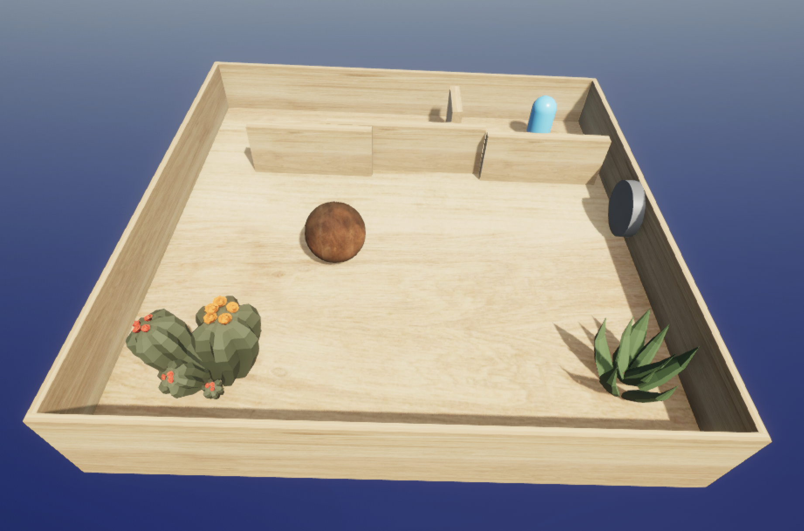

# Board Game

## Description

A simple 3D board game made with Unity. The player controls a ball that rolls around a board, trying to hit targets and avoid obstacles.

This game has been developed as part of the Applications Interactives course at HEAD-Genève.

The game is a work in progress and will probably never be finished. It has many bugs and is not optimized. It is not intended to be a commercial product. You can however still have fun playing it and testing it.

The current version can be played [here](https://prossel.github.io/CV2509BoardGame/).

## Ideas for future improvements

## V 1.0

* [ ] Add sound effects
  * [x] hit
  * [ ] win
  * [ ] game over
  * [ ] score
  * [ ] power-up
* [x] Detect ball loss
* [x] Add levels
* [x] Add bumpers
* [x] Add colors and textures
* [ ] Add more obstacles
  * [x] Add walls
  * [x] Add moving obstacles
  * [x] Add rotating obstacles
  * [x] Add sliding obstacles (doors)
  * [ ] Add one-way walls
  * [ ] Add teleporters
  * [x] Add more targets to hit in sequence (Susana)
  * [x] Add an elevator (Jennifer)
  * [ ] Add a hole (Fuonna)
  * [ ] Add a pair of parrallel bars (Antonin)
  * [ ] Add an outside path (get out of the board on some tricky place that brings you back to another unreachable place)
  * [x] Add a moving platform
  * [ ] Add a seesaw
  * [x] Add a catapult
  * [ ] Add a fan
  * [x] Add a ramp
* [ ] Add foes
  * [ ] Chasing foes
  * [ ] Random moving foes
  * [ ] Traps
  * [x] Ejectors
  * [ ] Bombs
  * [x] Spiky thing (kills the ball by Yol)
*[ ] Limit number of balls then game over

## V 2.0

* [ ] Add transition between levels
* [x] Add animations
* [ ] Add environment
* [x] Add UI
* [ ] Add score
* [ ] Add timer
* [ ] Add more balls
* [ ] Add power-ups
* [ ] Add multiplayer
* [x] Add restart button
* [x] Add main menu
* [ ] Add lives
